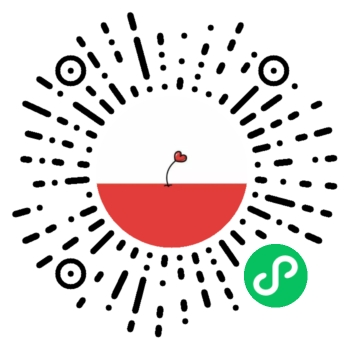
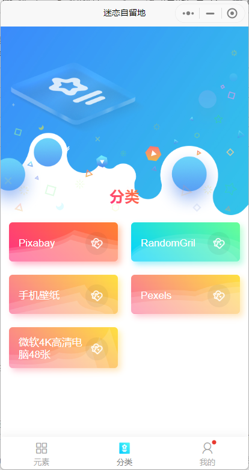
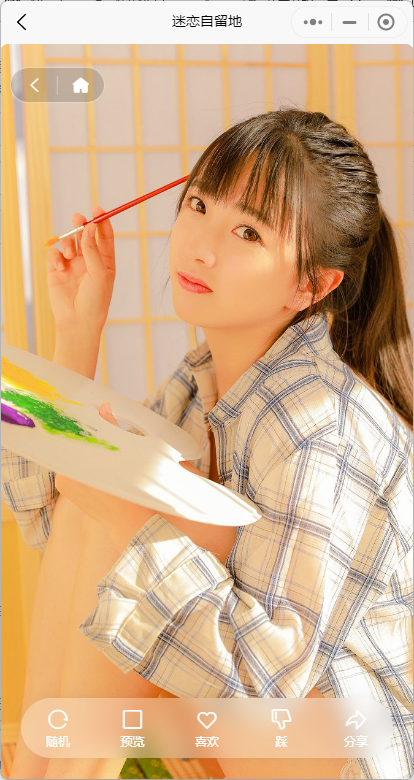
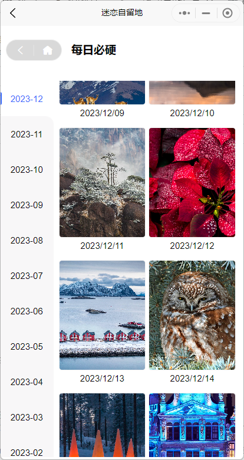
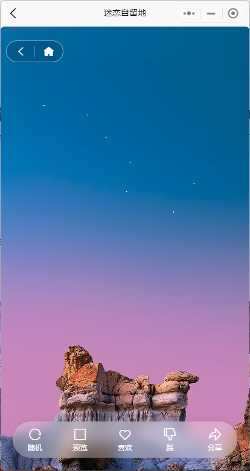
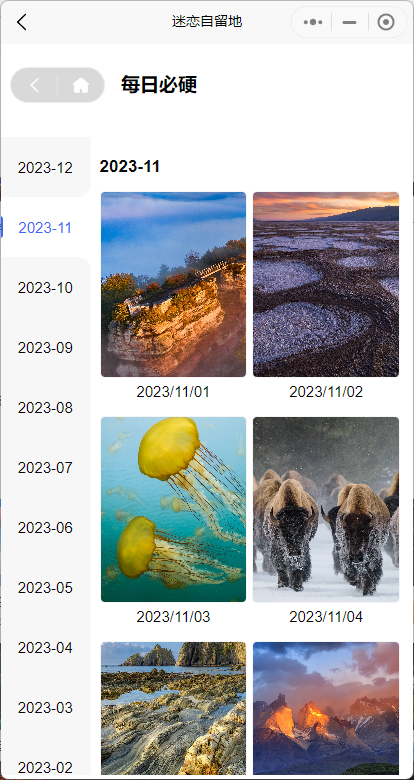
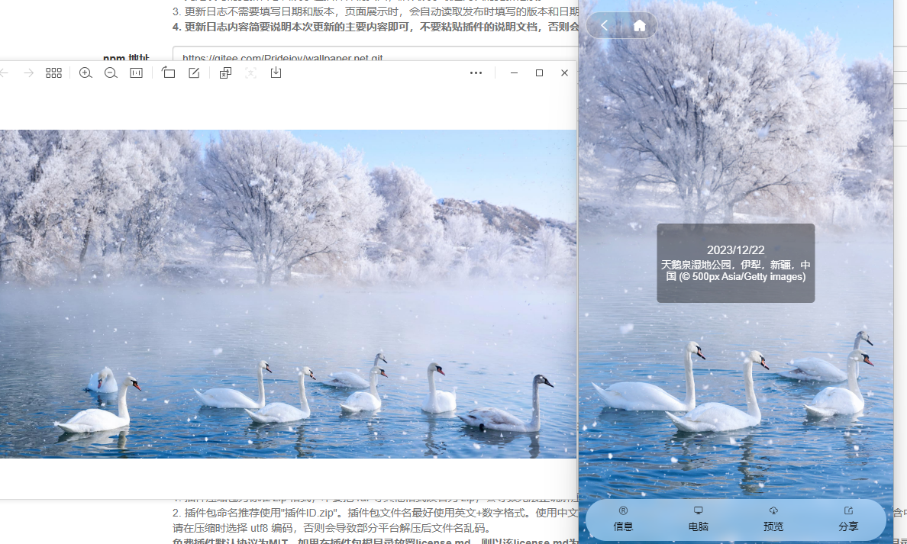
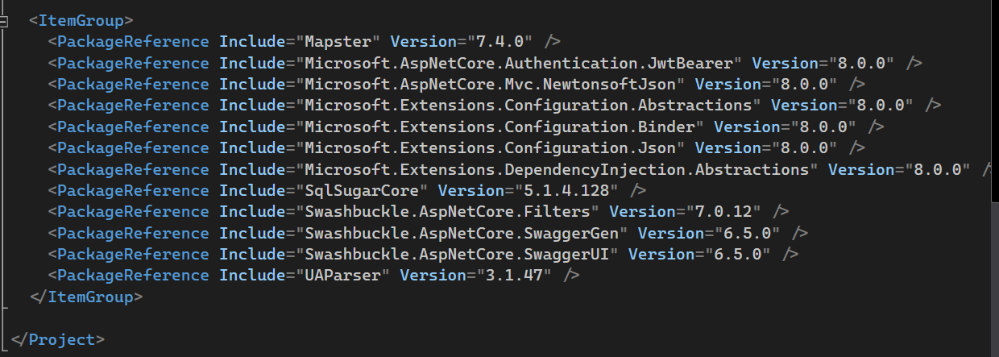

# Wallpaper.Net 迷恋图库

#### 🎁项目介绍

Wallpaper.Net （迷恋图库）是一款基于Net+Vue+UNIAPP+TUNIAOUI的开源壁纸小程序 ，解决开发过程中的告别其他项目依赖。

> 一学就会，轻松上手

前端基于Vue+UNIAPP+TUNIAOUI, 并在此基础上增加更模板，方便实现更多功能,
后端基于NET8 (原生封装，不依赖其他封装),ORM 采用 Sqlsugar+单例模式,插件式开发。

将日常开发中的业务场景模板化，并坚持以人为本,以业务为中心,做到开箱即用,代码简洁、易扩展，注释详细，文档齐全，让你的开发少走弯路。

> 阅历痛点，相见恨晚！让 .NET 开发更简单，更通用，更流行！

#### 🍁体验地址

#### ✨后端代码

<https://gitee.com/Pridejoy/MalusAdmin>

#### 🍎效果截图

<table>
  <tr>
    <td></td>
    <td></td>
    <td></td>
  </tr>
  <tr>
    <td></td>
    <td></td>
    <td></td>
  </tr>
  <tr>
    <td></td>
    <td></td>
    <td></td>
  </tr>
  <tr>
    <td colspan="3"></td>
  </tr>
</table>

#### 🍖基本设计思路

* [ ] 创建表库
* [ ] 后台服务（每天自动更新）

* 依赖于抽象
  
  依赖倒置原则，控制反转（IoC）
* 切面编程（AOP）
  
  权限、日志、异常等通过过滤器（Filter）或中间件（Middleware）等实现，集中编程
* 可配置
* 自动注册
  
  自动注册实体（Entity）、自动注册服务类（Service）等

## 🎀快速开始

请参考[使用手册](./doc/使用手册.md)

##### 🍭ORM 基于 Sqlsugar

SqlSugar 是一款老牌.NET 开源 ORM 框架，由果糖大数据科技团队维护和更新 ，开箱即用
最易上手的 ORM 框架，本系统也是基于 Sqlsugar 单例模式+CodeFirst+仓储的结构，无需担心作用域问题，直接爽撸！

文档地址:[https://www.donet5.com/Home/Doc](https://www.donet5.com/Home/Doc)

源码地址:[https://gitee.com/dotnetchina/SqlSugar](https://gitee.com/dotnetchina/SqlSugar)

#### 💐特别鸣谢

[Sqlsugar](https://gitee.com/dotnetchina/SqlSugar.git)

[SimpleApp](https://gitee.com/lisheng741/simpleapp.git)

[Blog.Core](https://gitee.com/laozhangIsPhi/Blog.Core)

感谢这些优秀的开源项目！

#### 地址

QQ交流群：725883767

欢迎关注公众号：【Net分享】

